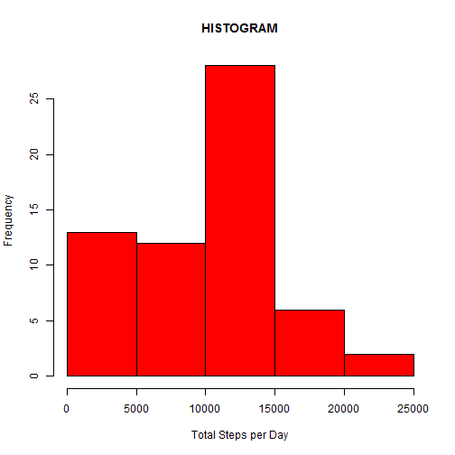
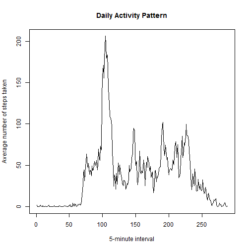
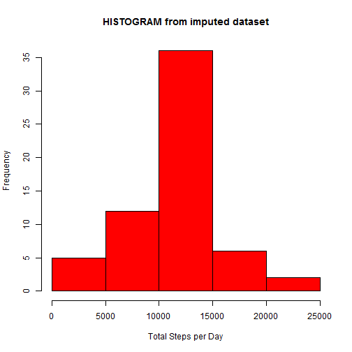
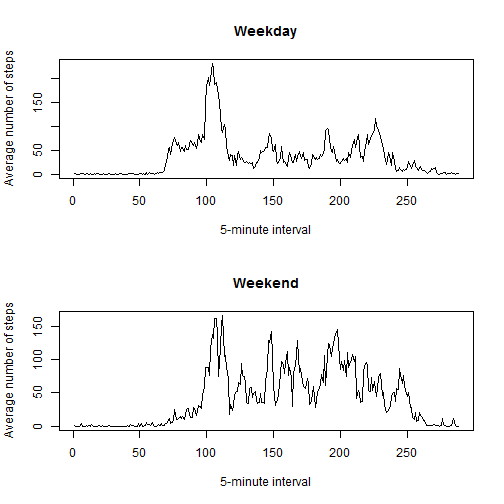

# Course Project 1

This is a report for Course Project 1 of Reproducible Research.

## Loading and preprocessing the data


```r
data <- read.csv("activity.csv")
names(data)
```

```
## [1] "steps"    "date"     "interval"
```

```r
nrow(data)
```

```
## [1] 17568
```

Changing the format of date will be useful further, when checking the differences between weekdays and weekends.

```r
data$date <- as.Date(data$date, "%Y-%m-%d")
```


## What is mean total number of steps taken per day?


```r
totalStepsPerDay <- tapply(data$steps, data$date, sum, na.rm=TRUE)

hist(totalStepsPerDay, col="red", xlab="Total Steps per Day", main="HISTOGRAM")
```

 

Mean of the total number of steps taken per day is: 9354.23.

```r
mean(totalStepsPerDay)
```

```
## [1] 9354.23
```

Median of the total number of steps taken per day is: 10395.

```r
median(totalStepsPerDay)
```

```
## [1] 10395
```


## What is the average daily activity pattern?


```r
averageActivity <- tapply(data$steps, data$interval, mean, na.rm=TRUE)
plot(averageActivity, type="l", xlab="5-minute interval", ylab="Average number of steps taken", main="Daily Activity Pattern")
```

 

```r
which.max(averageActivity)
```

```
## 835 
## 104
```
The maximum number of steps contains the 104th interval identifier: 835. 


## Imputing missing values

Total number of missing values in the dataset is: 2304.

```r
sum(is.na(data$steps))
```

```
## [1] 2304
```

The new dataset will have the missing values filled in using the mean for that 5-minute interval.

```r
newData <- data
newData$steps[which(is.na(newData$steps))] <- tapply(newData$steps, newData$interval, mean, na.rm=TRUE)

newTotalStepsPerDay <- tapply(newData$steps, newData$date, sum, na.rm=TRUE)
hist(newTotalStepsPerDay, col="red", xlab="Total Steps per Day", main="HISTOGRAM from imputed dataset")
```

 

Mean of the total number of steps taken per day in imputed dataset is: 10766.19.

```r
mean(newTotalStepsPerDay)
```

```
## [1] 10766.19
```

Median of the total number of steps taken per day in imputed dataset is: 10766.19.

```r
median(newTotalStepsPerDay)
```

```
## [1] 10766.19
```

After imputing missing values histogram is more like normal distribution.
Mean and median are closer to each other than in the dataset with missing values.


## Are there differences in activity patterns between weekdays and weekends?


```r
newData <- cbind(newData, day = "weekday")
newData$day <- as.character(newData$day)
newData$day[which(weekdays(newData$date) %in% c("sobota", "niedziela"))] <- "weekend"

averageWeekday <- tapply(newData$steps[newData$day=="weekday"], newData$interval[newData$day=="weekday"], mean)
averageWeekend <- tapply(newData$steps[newData$day=="weekend"], newData$interval[newData$day=="weekend"], mean)

par(mfrow = c(2, 1))
plot(averageWeekday, type="l", xlab="5-minute interval", ylab="Average number of steps", main="Weekday")
plot(averageWeekend, type="l", xlab="5-minute interval", ylab="Average number of steps", main="Weekend")
```

 

During weekdays there is lower activity.
